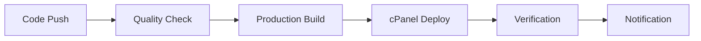

# 🚀 CI/CD Guide for CharlitexMobileConnect

Complete guide for setting up and using the CI/CD pipeline for automatic cPanel deployment.

## 📋 Overview

Your CI/CD pipeline includes:

- **Quality Checks**: Linting, testing, security audits
- **Production Builds**: Optimized builds with environment variables
- **cPanel Deployment**: Automatic FTP deployment to your hosting
- **Staging Environment**: Separate staging deployment for testing
- **Notifications**: Deployment status and summaries

## 🔧 Pipeline Files

```
.github/workflows/
├── cpanel-deploy.yml     # Main production deployment
├── deploy-staging.yml    # Staging environment deployment
└── deploy.yml           # Simple deployment (legacy)
```

## ⚙️ Setup Instructions

### 1. **Configure GitHub Secrets**

Go to your GitHub repository → **Settings** → **Secrets and Variables** → **Actions**

#### Production Secrets:

```
FTP_SERVER=ftp.yourdomain.com
FTP_USERNAME=your_cpanel_username
FTP_PASSWORD=your_cpanel_password
VITE_SUPABASE_URL=https://your-project.supabase.co
VITE_SUPABASE_ANON_KEY=your_supabase_anon_key
VITE_APP_URL=https://yourdomain.com
```

#### Staging Secrets (Optional):

```
FTP_SERVER_STAGING=ftp.yourdomain.com
FTP_USERNAME_STAGING=your_cpanel_username
FTP_PASSWORD_STAGING=your_cpanel_password
VITE_SUPABASE_URL_STAGING=https://your-staging-project.supabase.co
VITE_SUPABASE_ANON_KEY_STAGING=your_staging_supabase_key
VITE_APP_URL_STAGING=https://staging.yourdomain.com
```

### 2. **cPanel Directory Structure**

Ensure your cPanel has the correct directory structure:

```
/public_html/              # Production files
/public_html/staging/      # Staging files (optional)
```

### 3. **Environment Setup**

The pipeline will automatically:

- ✅ Install dependencies
- ✅ Run quality checks
- ✅ Build optimized production bundle
- ✅ Deploy to cPanel via FTP
- ✅ Verify deployment

## 🚀 Deployment Workflows

### **Production Deployment**

**Triggers:**

- Push to `main` or `master` branch
- Manual trigger via GitHub Actions UI
- Pull request merge

**Process:**



**Steps:**

1. 🔍 **Quality Check**: ESLint, build test, security audit
2. 🏗️ **Production Build**: Optimized bundle with environment variables
3. 🚀 **cPanel Deploy**: FTP upload to `/public_html/`
4. ✅ **Verification**: Site accessibility check
5. 📢 **Notification**: Deployment summary

### **Staging Deployment**

**Triggers:**

- Push to `develop` or `staging` branch
- Manual trigger

**Purpose:**

- Test changes before production
- Client preview and approval
- Feature testing

## 🎛️ Manual Deployment

### **GitHub Actions UI:**

1. Go to **Actions** tab in your repository
2. Select "🚀 Deploy CharlitexMobileConnect to cPanel"
3. Click **Run workflow**
4. Choose options:
   - **Environment**: production/staging
   - **Skip tests**: true/false

### **Command Line:**

```bash
# Trigger production deployment
git push origin main

# Trigger staging deployment
git push origin staging
```

## 📊 Pipeline Features

### **Quality Assurance**

- ✅ **ESLint**: Code quality and consistency
- ✅ **Build Test**: Ensures successful compilation
- ✅ **Security Audit**: npm security vulnerability check
- ✅ **Bundle Analysis**: Size optimization monitoring

### **Performance Optimization**

- ✅ **Code Splitting**: Vendor and app chunks
- ✅ **Asset Optimization**: Minification and compression
- ✅ **Cache Management**: Efficient build caching
- ✅ **Bundle Size Monitoring**: Automatic size warnings

### **Deployment Safety**

- ✅ **Pre-deployment Checks**: Verify secrets and build
- ✅ **Rollback Capability**: Previous deployment states
- ✅ **Error Handling**: Comprehensive error reporting
- ✅ **Timeout Protection**: Prevents hanging deployments

## 🔍 Monitoring & Debugging

### **GitHub Actions Dashboard**

Monitor deployments at:

```
https://github.com/YOUR_USERNAME/CharlitexMobileConnect/actions
```

### **Deployment Status**

- ✅ **Green**: Successful deployment
- ❌ **Red**: Failed deployment (check logs)
- 🟡 **Yellow**: In progress
- ⚪ **Gray**: Queued or skipped

### **Common Issues & Solutions**

#### **FTP Connection Issues**

```bash
❌ Error: FTP connection failed
✅ Solution:
   - Verify FTP_SERVER, FTP_USERNAME, FTP_PASSWORD secrets
   - Check cPanel FTP access permissions
   - Ensure server allows FTP connections
```

#### **Build Failures**

```bash
❌ Error: Build failed with exit code 1
✅ Solution:
   - Check environment variables are set correctly
   - Verify all dependencies are installed
   - Review build logs for specific errors
```

#### **Deployment Timeout**

```bash
❌ Error: Deployment timed out
✅ Solution:
   - Large files may cause timeouts
   - Check internet connectivity to server
   - Reduce bundle size if too large
```

### **Debug Mode**

Enable verbose logging by:

1. Setting `log-level: verbose` in workflow
2. Adding debug steps with `echo` commands
3. Using `workflow_dispatch` for manual testing

## 📈 Performance Metrics

### **Build Performance**

- **Install Time**: ~30-60 seconds
- **Build Time**: ~60-120 seconds
- **Deploy Time**: ~60-180 seconds (depends on bundle size)
- **Total Time**: ~3-6 minutes

### **Bundle Optimization**

- **Target Size**: < 1MB total
- **Code Splitting**: Vendor (~12KB), Supabase (~125KB), App (~205KB)
- **Compression**: Gzip compression enabled
- **Caching**: Browser and CDN caching optimized

## 🔒 Security Best Practices

### **Secrets Management**

- ✅ Never commit secrets to code
- ✅ Use GitHub encrypted secrets
- ✅ Rotate passwords regularly
- ✅ Use environment-specific secrets

### **Access Control**

- ✅ Limit FTP user permissions to web directory only
- ✅ Use strong passwords for FTP accounts
- ✅ Enable 2FA on GitHub account
- ✅ Review deployment logs regularly

## 🚨 Emergency Procedures

### **Rollback Deployment**

If deployment fails or causes issues:

1. **Quick Fix**: Revert to previous commit

   ```bash
   git revert HEAD
   git push origin main
   ```

2. **Manual Rollback**: Use cPanel File Manager

   - Access cPanel → File Manager
   - Restore from backup if available
   - Or manually upload previous version

3. **Emergency Disable**: Remove files
   - Create maintenance page in `/public_html/`
   - Investigate and fix issues
   - Redeploy when ready

### **Support Contacts**

- **GitHub Issues**: Repository issues tab
- **cPanel Support**: Your hosting provider
- **Supabase Support**: Supabase dashboard

## 🎯 Best Practices

### **Development Workflow**

1. 🔧 **Develop**: Work on feature branches
2. 🧪 **Test**: Push to staging for testing
3. 🔍 **Review**: Create pull requests for review
4. 🚀 **Deploy**: Merge to main for production

### **Quality Assurance**

- ✅ Test locally before pushing
- ✅ Use staging environment for previews
- ✅ Monitor deployment logs
- ✅ Test website after each deployment

### **Performance Monitoring**

- 📊 Monitor bundle sizes
- ⚡ Check Core Web Vitals
- 🔍 Review build performance
- 📈 Track deployment success rates

---

## 🎉 Quick Start

1. **Configure secrets** in GitHub repository
2. **Push code** to main branch
3. **Monitor deployment** in Actions tab
4. **Visit your website** to verify success

**Your CI/CD pipeline is now ready for automatic cPanel deployments! 🚀**
