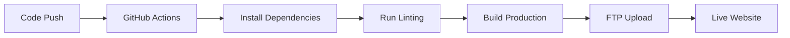

# 🚀 CharlitexMobileConnect Deployment Guide

This guide explains how to deploy your React/Vite application to HostPapa hosting with automated deployment using GitHub Actions.

## 📋 Prerequisites

- HostPapa hosting account with cPanel access
- Domain configured and pointing to your HostPapa hosting
- GitHub repository for your project
- Supabase project configured for production

## 🏗️ Deployment Architecture

```
GitHub Repository → GitHub Actions → Build Process → FTP Upload → HostPapa Server → Live Website
```

## 🛠️ Step 1: Prepare Your Application for Production

### 1.1 Environment Variables Setup

Create a `.env.production` file in your project root:

```bash
# Production Environment Variables
VITE_SUPABASE_URL=your_production_supabase_url
VITE_SUPABASE_ANON_KEY=your_production_supabase_anon_key
VITE_APP_URL=https://yourdomain.com
```

### 1.2 Update Vite Configuration

Update `vite.config.js` for production builds:

```javascript
import { defineConfig } from 'vite';
import react from '@vitejs/plugin-react';

export default defineConfig({
  plugins: [react()],
  base: '/', // Ensure correct base path for your domain
  build: {
    outDir: 'dist',
    assetsDir: 'assets',
    sourcemap: false, // Disable sourcemaps for production
    minify: 'terser',
    rollupOptions: {
      output: {
        manualChunks: {
          vendor: ['react', 'react-dom'],
          supabase: ['@supabase/supabase-js'],
        },
      },
    },
  },
  server: {
    port: 3000,
  },
});
```

### 1.3 Update Package.json Scripts

Add production build scripts to `package.json`:

```json
{
  "scripts": {
    "dev": "vite",
    "build": "vite build",
    "build:prod": "NODE_ENV=production vite build",
    "preview": "vite preview",
    "lint": "eslint .",
    "deploy": "npm run build:prod"
  }
}
```

## 🤖 Step 2: Set Up Automated Deployment with GitHub Actions

### 2.1 Create GitHub Actions Workflow

Create `.github/workflows/deploy.yml`:

```yaml
name: Deploy to HostPapa

on:
  push:
    branches: [main, master]
  pull_request:
    branches: [main, master]
  workflow_dispatch: # Allows manual triggering

jobs:
  build-and-deploy:
    runs-on: ubuntu-latest

    steps:
      - name: 🚚 Checkout code
        uses: actions/checkout@v4

      - name: 🔧 Setup Node.js
        uses: actions/setup-node@v4
        with:
          node-version: '18'
          cache: 'npm'

      - name: 📦 Install dependencies
        run: npm ci

      - name: 🔍 Run linting
        run: npm run lint

      - name: 🏗️ Build application
        run: npm run build:prod
        env:
          VITE_SUPABASE_URL: ${{ secrets.VITE_SUPABASE_URL }}
          VITE_SUPABASE_ANON_KEY: ${{ secrets.VITE_SUPABASE_ANON_KEY }}
          VITE_APP_URL: ${{ secrets.VITE_APP_URL }}

      - name: 📁 List build files (debug)
        run: ls -la dist/

      - name: 🚀 Deploy to HostPapa via FTP
        uses: SamKirkland/FTP-Deploy-Action@v4.3.4
        with:
          server: ${{ secrets.FTP_SERVER }}
          username: ${{ secrets.FTP_USERNAME }}
          password: ${{ secrets.FTP_PASSWORD }}
          local-dir: ./dist/
          server-dir: /public_html/
          exclude: |
            **/.git*
            **/.git*/**
            **/node_modules/**
            .env*
```

### 2.2 Set Up GitHub Secrets

In your GitHub repository, go to **Settings > Secrets and Variables > Actions** and add:

| Secret Name              | Description                  | Example                                    |
| ------------------------ | ---------------------------- | ------------------------------------------ |
| `FTP_SERVER`             | Your HostPapa FTP server     | `ftp.yourdomain.com` or `cpanel-server-ip` |
| `FTP_USERNAME`           | Your cPanel FTP username     | `your_username@yourdomain.com`             |
| `FTP_PASSWORD`           | Your cPanel FTP password     | `your_secure_password`                     |
| `VITE_SUPABASE_URL`      | Production Supabase URL      | `https://xxx.supabase.co`                  |
| `VITE_SUPABASE_ANON_KEY` | Production Supabase anon key | `eyJhbGciOiJIUzI1NiIs...`                  |
| `VITE_APP_URL`           | Your production domain       | `https://yourdomain.com`                   |

## 🏠 Step 3: HostPapa/cPanel Configuration

### 3.1 Get FTP Details from cPanel

1. Log into your HostPapa cPanel
2. Navigate to **File Manager** or **FTP Accounts**
3. Note your FTP server details:
   - **Server**: Usually `ftp.yourdomain.com` or your server IP
   - **Username**: Your cPanel username or FTP account
   - **Password**: Your account password
   - **Port**: Usually 21 (FTP) or 22 (SFTP)

### 3.2 Prepare Public HTML Directory

1. Access **File Manager** in cPanel
2. Navigate to `public_html/` directory
3. This is where your built application files will be uploaded
4. Ensure the directory has proper permissions (755)

### 3.3 Configure Domain (if needed)

1. In cPanel, go to **Subdomains** or **Addon Domains**
2. Ensure your domain points to the correct directory
3. For main domain: `public_html/`
4. For subdomain: `public_html/subdomain_name/`

## 🔄 Step 4: Deployment Workflow

### 4.1 Manual Deployment

```bash
# Build for production locally
npm run build:prod

# Upload dist/ contents to your HostPapa public_html/ via FTP client
```

### 4.2 Automated Deployment Process

1. **Push to GitHub**: Push your code to the main branch
2. **GitHub Actions Triggers**: Workflow automatically starts
3. **Build Process**: Application builds with production environment
4. **FTP Upload**: Built files upload to HostPapa server
5. **Live Website**: Changes are immediately live on your domain

### 4.3 Deployment Steps Breakdown



## 🔧 Step 5: Environment-Specific Configuration

### 5.1 Development vs Production

| Environment | Build Command        | Environment File  | Supabase            |
| ----------- | -------------------- | ----------------- | ------------------- |
| Development | `npm run dev`        | `.env.local`      | Development project |
| Production  | `npm run build:prod` | `.env.production` | Production project  |

### 5.2 Supabase Configuration

Ensure you have separate Supabase projects for development and production:

**Development:**

- Database with test data
- Relaxed security policies
- Development URL/keys

**Production:**

- Clean database
- Strict security policies
- Production URL/keys

## 🚨 Step 6: Troubleshooting

### 6.1 Common Issues

| Issue                     | Solution                                     |
| ------------------------- | -------------------------------------------- |
| Build fails               | Check environment variables and dependencies |
| FTP upload fails          | Verify FTP credentials and server details    |
| White screen after deploy | Check console for errors, verify base path   |
| Assets not loading        | Ensure correct asset paths in build          |

### 6.2 Debugging Commands

```bash
# Test build locally
npm run build:prod
npm run preview

# Check build output
ls -la dist/

# Test FTP connection (replace with your details)
ftp ftp.yourdomain.com
```

### 6.3 Log Monitoring

- **GitHub Actions**: Check workflow logs in GitHub repository
- **HostPapa**: Use cPanel Error Logs to monitor application errors
- **Browser**: Check Developer Tools console for frontend errors

## ⚡ Step 7: Optimization & Best Practices

### 7.1 Performance Optimization

```javascript
// vite.config.js - Additional optimizations
export default defineConfig({
  build: {
    rollupOptions: {
      output: {
        assetFileNames: 'assets/[name]-[hash][extname]',
        chunkFileNames: 'assets/[name]-[hash].js',
        entryFileNames: 'assets/[name]-[hash].js',
      },
    },
  },
});
```

### 7.2 Security Considerations

- Use HTTPS for production domain
- Keep Supabase keys secure in GitHub Secrets
- Enable rate limiting in Supabase
- Configure proper CORS settings

### 7.3 Monitoring & Maintenance

- Set up Supabase alerts for database issues
- Monitor GitHub Actions for failed deployments
- Regularly update dependencies
- Back up your production database

## 🎯 Step 8: Go Live Checklist

- [ ] Production environment variables configured
- [ ] Supabase production project set up
- [ ] GitHub repository secrets added
- [ ] Domain configured in HostPapa
- [ ] FTP credentials verified
- [ ] GitHub Actions workflow tested
- [ ] SSL certificate active (HTTPS)
- [ ] Application tested in production
- [ ] Database populated with initial data
- [ ] Error monitoring set up

## 🔄 Continuous Deployment

Once set up, your deployment process becomes:

1. **Develop** → Make changes locally
2. **Test** → Run `npm run dev` and test features
3. **Build** → Test with `npm run build:prod && npm run preview`
4. **Deploy** → Push to GitHub main branch
5. **Live** → GitHub Actions automatically deploys to HostPapa

---

## 📞 Support

If you encounter issues:

- Check GitHub Actions logs for build errors
- Verify HostPapa cPanel file manager for uploaded files
- Contact HostPapa support for server-specific issues
- Review Supabase dashboard for database connectivity

**Happy Deploying! 🚀**
