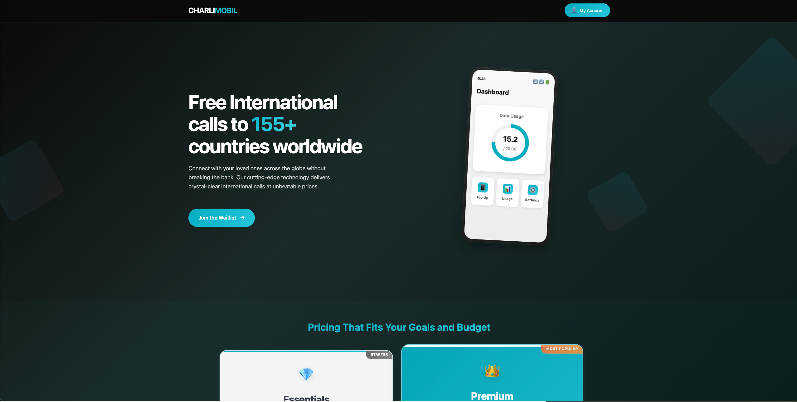

# CharlitexMobileConnect 📞

A modern React-based web application offering affordable international calling services to 155+ countries worldwide. Connect with your loved ones across the globe without breaking the bank with crystal-clear voice quality and unbeatable pricing.

## 🌟 Features

- **Global Reach**: Free unlimited calls to 155+ countries worldwide
- **Affordable Pricing**: Starting at just $15/month with transparent pricing
- **Modern UI/UX**: Beautiful, responsive design with interactive phone mockups
- **Waitlist System**: User registration with email validation and OTP verification
- **Flexible Plans**: Two tiers (Essentials & Premium) to fit different needs
- **Real-time Communication**: Advanced VoIP technology for instant connections

## 🚀 Tech Stack

- **Frontend**: React 19.1.1 with modern hooks and functional components
- **Build Tool**: Vite for fast development and optimized builds
- **Styling**: Tailwind CSS 4.1.12 with custom component styles
- **Backend**: Supabase integration for authentication and database
- **Validation**: libphonenumber-js for international phone number validation
- **Code Quality**: ESLint with React-specific rules and best practices

## 📁 Project Structure

```
src/
├── components/
│   ├── auth/           # Authentication components (OTP, Number Input)
│   ├── common/         # Shared components (Header, Waitlist Modal)
│   ├── home/           # Home page sections (Hero, Features, Pricing, CTA)
│   └── ui/             # Reusable UI components (Button, Loading, etc.)
├── config/             # Configuration files (Supabase setup)
├── hooks/              # Custom React hooks (API, OTP, Phone validation)
├── services/           # API services (Auth, Database operations)
├── styles/             # CSS styling (components and global styles)
├── utils/              # Utility functions (Phone validation helpers)
└── constants/          # Application constants and validation rules
```

## 💰 Pricing Plans

### Essentials - $15/month

- Unlimited calls to US recipients
- Unlimited international calls\*
- $40 setup fee
- Perfect for personal use

### Premium - $55/month (Most Popular)

- Everything in Essentials
- Unlimited data + hotspot (US)
- 20GB international roaming
- $50 setup fee
- Everything you need & more

\*Free unlimited calling to all nations except limited minutes to select countries

## 🏠 Home Page Design



_The home page features a clean, modern design with:_

- **Hero Section**: Compelling headline with phone mockup visualization
- **Features Section**: Four key value propositions with icons
- **Pricing Section**: Two-tier pricing cards with detailed feature lists
- **Call-to-Action**: Multiple touchpoints to join the waitlist

> 📸 **Note**: To add the actual screenshot, capture the home page design and save it as `screenshots/home-page-design.png` in the project root, then the image will display above.

## 🛠 Installation & Setup

1. **Clone the repository**

   ```bash
   git clone <repository-url>
   cd CharlitexMobileConnect
   ```

2. **Install dependencies**

   ```bash
   npm install
   ```

3. **Set up environment variables**

   ```bash
   # Create .env file with your Supabase credentials
   VITE_SUPABASE_URL=your_supabase_url
   VITE_SUPABASE_ANON_KEY=your_supabase_anon_key
   ```

4. **Start development server**

   ```bash
   npm run dev
   ```

5. **Build for production**
   ```bash
   npm run build
   ```

## 🔧 Available Scripts

- `npm run dev` - Start development server with hot reload
- `npm run build` - Build for production
- `npm run preview` - Preview production build locally
- `npm run lint` - Run ESLint for code quality checks

## 🌐 Key Components

- **HeroSection**: Main landing area with value proposition
- **PricingSection**: Interactive pricing cards with plan selection
- **FeaturesSection**: Highlight of key service benefits
- **WaitlistModal**: User registration with phone validation
- **OTPModal**: Secure phone number verification
- **PhoneMockup**: Interactive mobile app visualization

## 🔐 Authentication Flow

1. User enters phone number in waitlist modal
2. Phone number validation using libphonenumber-js
3. OTP sent via Supabase auth system
4. User verification and account creation
5. Welcome to CharlitexMobileConnect community!

## 📱 Responsive Design

The application is fully responsive and optimized for:

- **Desktop**: Full-featured experience with hover effects
- **Tablet**: Optimized layout for medium screens
- **Mobile**: Touch-friendly interface with mobile-first approach

## 🤝 Contributing

1. Fork the repository
2. Create your feature branch (`git checkout -b feature/AmazingFeature`)
3. Commit your changes (`git commit -m 'Add some AmazingFeature'`)
4. Push to the branch (`git push origin feature/AmazingFeature`)
5. Open a Pull Request

## 📄 License

This project is private and proprietary to CharlitexMobileConnect.

---

Built with ❤️ by the CharlitexMobileConnect team
